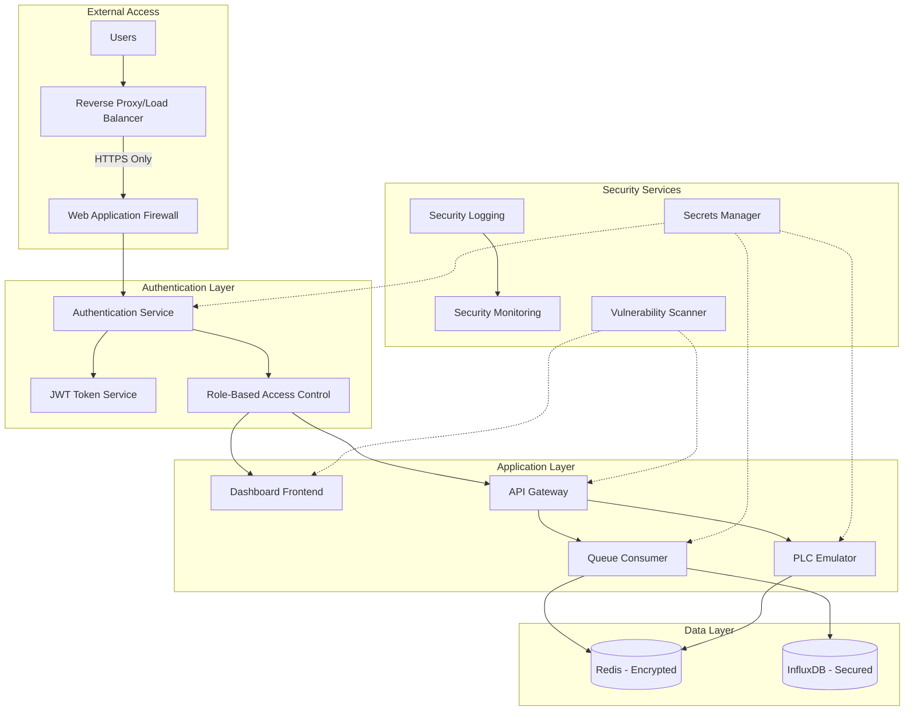
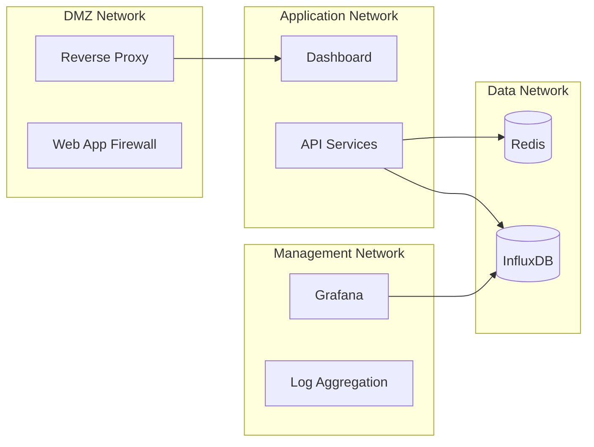

# Security Hardening Design Document

## Overview

This design document outlines the comprehensive security hardening implementation for the factory dashboard system. The design addresses critical vulnerabilities including exposed credentials, lack of authentication, network security gaps, and potential injection attacks. The solution implements a layered security approach with defense in depth principles.

## Architecture

### Security Architecture Overview



### Network Security Design



## Components and Interfaces

### 1. Secrets Management System

**Purpose:** Centralized, secure credential management across all environments

**Components:**
- Environment-based secrets loading
- Credential rotation support
- Secure credential storage
- Runtime credential injection

**Interface:**
```typescript
interface SecretsManager {
  getSecret(key: string, environment?: string): Promise<string>;
  rotateSecret(key: string): Promise<void>;
  validateSecrets(): Promise<boolean>;
  maskSensitiveData(data: any): any;
}
```

**Implementation Strategy:**
- Docker secrets for containerized deployments
- Environment variable injection for development
- External secrets management integration (HashiCorp Vault, AWS Secrets Manager)
- Automatic credential masking in logs

### 2. Authentication and Authorization Service

**Purpose:** Secure user authentication and role-based access control

**Components:**
- JWT-based authentication
- Role-based authorization
- Session management
- Rate limiting and brute force protection

**Interface:**
```typescript
interface AuthenticationService {
  authenticate(credentials: LoginCredentials): Promise<AuthResult>;
  validateToken(token: string): Promise<UserContext>;
  refreshToken(refreshToken: string): Promise<AuthResult>;
  logout(token: string): Promise<void>;
}

interface AuthorizationService {
  hasPermission(user: UserContext, resource: string, action: string): boolean;
  getUserRoles(userId: string): Promise<Role[]>;
  checkResourceAccess(user: UserContext, resourceId: string): boolean;
}
```

**Security Features:**
- Bcrypt password hashing
- JWT with short expiration times
- Refresh token rotation
- Account lockout after failed attempts
- IP-based rate limiting

### 3. Network Security Layer

**Purpose:** Secure network communications and service isolation

**Components:**
- Reverse proxy with SSL termination
- Docker network segmentation
- Security headers implementation
- CORS policy enforcement

**Configuration:**
```nginx
# Enhanced Nginx Security Configuration
server {
    listen 443 ssl http2;
    ssl_certificate /etc/ssl/certs/dashboard.crt;
    ssl_certificate_key /etc/ssl/private/dashboard.key;
    
    # Security Headers
    add_header Strict-Transport-Security "max-age=31536000; includeSubDomains" always;
    add_header Content-Security-Policy "default-src 'self'; script-src 'self' 'unsafe-inline'; style-src 'self' 'unsafe-inline'" always;
    add_header X-Frame-Options "SAMEORIGIN" always;
    add_header X-Content-Type-Options "nosniff" always;
    add_header Referrer-Policy "strict-origin-when-cross-origin" always;
    
    # Rate Limiting
    limit_req_zone $binary_remote_addr zone=api:10m rate=10r/s;
    limit_req zone=api burst=20 nodelay;
}
```

### 4. Input Validation and Sanitization

**Purpose:** Prevent injection attacks and validate all user inputs

**Components:**
- Input validation middleware
- SQL injection prevention
- Command injection prevention
- XSS protection

**Interface:**
```typescript
interface InputValidator {
  validateEquipmentId(id: string): ValidationResult;
  validateTimeRange(range: string): ValidationResult;
  sanitizeCommand(command: string, allowedCommands: string[]): string;
  escapeHtml(input: string): string;
}
```

### 5. Security Monitoring and Logging

**Purpose:** Comprehensive security event logging and monitoring

**Components:**
- Structured security logging
- Real-time security monitoring
- Anomaly detection
- Incident response automation

**Interface:**
```typescript
interface SecurityLogger {
  logAuthenticationEvent(event: AuthEvent): void;
  logAccessAttempt(attempt: AccessAttempt): void;
  logSecurityIncident(incident: SecurityIncident): void;
  generateSecurityReport(timeRange: TimeRange): SecurityReport;
}
```

## Data Models

### User and Authentication Models

```typescript
interface User {
  id: string;
  username: string;
  email: string;
  passwordHash: string;
  roles: Role[];
  lastLogin: Date;
  failedLoginAttempts: number;
  accountLocked: boolean;
  lockoutExpiry?: Date;
  createdAt: Date;
  updatedAt: Date;
}

interface Role {
  id: string;
  name: string;
  permissions: Permission[];
  description: string;
}

interface Permission {
  resource: string;
  actions: string[];
  conditions?: Record<string, any>;
}

interface AuthToken {
  userId: string;
  token: string;
  refreshToken: string;
  expiresAt: Date;
  issuedAt: Date;
  ipAddress: string;
  userAgent: string;
}
```

### Security Event Models

```typescript
interface SecurityEvent {
  id: string;
  type: SecurityEventType;
  severity: SecuritySeverity;
  timestamp: Date;
  userId?: string;
  ipAddress: string;
  userAgent?: string;
  resource: string;
  action: string;
  success: boolean;
  details: Record<string, any>;
}

enum SecurityEventType {
  AUTHENTICATION = 'authentication',
  AUTHORIZATION = 'authorization',
  DATA_ACCESS = 'data_access',
  CONFIGURATION_CHANGE = 'configuration_change',
  SECURITY_VIOLATION = 'security_violation'
}

enum SecuritySeverity {
  LOW = 'low',
  MEDIUM = 'medium',
  HIGH = 'high',
  CRITICAL = 'critical'
}
```

### Configuration Security Models

```typescript
interface SecureConfiguration {
  environment: string;
  secrets: Record<string, SecretConfig>;
  security: SecurityConfig;
  monitoring: MonitoringConfig;
}

interface SecretConfig {
  source: 'env' | 'docker_secret' | 'external';
  key: string;
  required: boolean;
  masked: boolean;
}

interface SecurityConfig {
  authentication: {
    enabled: boolean;
    provider: string;
    sessionTimeout: number;
    maxFailedAttempts: number;
    lockoutDuration: number;
  };
  authorization: {
    enabled: boolean;
    defaultRole: string;
    roleHierarchy: Record<string, string[]>;
  };
  network: {
    corsOrigins: string[];
    rateLimiting: RateLimitConfig;
    securityHeaders: Record<string, string>;
  };
}
```

## Error Handling

### Security Error Categories

1. **Authentication Errors**
   - Invalid credentials
   - Account locked
   - Token expired
   - Session timeout

2. **Authorization Errors**
   - Insufficient permissions
   - Resource access denied
   - Role validation failed

3. **Input Validation Errors**
   - Invalid input format
   - Injection attempt detected
   - Rate limit exceeded

4. **Network Security Errors**
   - SSL/TLS handshake failed
   - CORS violation
   - Security header validation failed

### Error Response Strategy

```typescript
interface SecurityErrorResponse {
  error: {
    code: string;
    message: string;
    type: SecurityErrorType;
    timestamp: Date;
    requestId: string;
  };
  // Never expose sensitive details in error responses
}

// Security-focused error handling
class SecurityErrorHandler {
  handleAuthenticationError(error: AuthError): SecurityErrorResponse {
    // Log detailed error internally
    this.securityLogger.logAuthenticationEvent({
      type: 'authentication_failed',
      details: error,
      severity: 'medium'
    });
    
    // Return generic error to client
    return {
      error: {
        code: 'AUTH_FAILED',
        message: 'Authentication failed',
        type: SecurityErrorType.AUTHENTICATION,
        timestamp: new Date(),
        requestId: generateRequestId()
      }
    };
  }
}
```

## Testing Strategy

### Security Testing Approach

1. **Authentication Testing**
   - Valid/invalid credential combinations
   - Token expiration and refresh
   - Session management
   - Brute force protection

2. **Authorization Testing**
   - Role-based access control
   - Permission validation
   - Resource access restrictions
   - Privilege escalation attempts

3. **Input Validation Testing**
   - SQL injection attempts
   - Command injection attempts
   - XSS payload testing
   - Path traversal testing

4. **Network Security Testing**
   - SSL/TLS configuration
   - Security header validation
   - CORS policy testing
   - Rate limiting effectiveness

5. **Penetration Testing**
   - Automated vulnerability scanning
   - Manual security testing
   - Social engineering simulation
   - Physical security assessment

### Security Test Implementation

```typescript
describe('Security Tests', () => {
  describe('Authentication', () => {
    it('should reject invalid credentials', async () => {
      const result = await authService.authenticate({
        username: 'invalid',
        password: 'wrong'
      });
      expect(result.success).toBe(false);
      expect(result.error).toBe('AUTH_FAILED');
    });

    it('should lock account after failed attempts', async () => {
      // Simulate multiple failed login attempts
      for (let i = 0; i < 5; i++) {
        await authService.authenticate({
          username: 'testuser',
          password: 'wrong'
        });
      }
      
      const result = await authService.authenticate({
        username: 'testuser',
        password: 'correct'
      });
      expect(result.error).toBe('ACCOUNT_LOCKED');
    });
  });

  describe('Input Validation', () => {
    it('should prevent SQL injection', async () => {
      const maliciousInput = "'; DROP TABLE users; --";
      const result = await equipmentService.getEquipment(maliciousInput);
      expect(result.error).toBe('INVALID_INPUT');
    });

    it('should sanitize command parameters', () => {
      const maliciousCommand = 'restart; rm -rf /';
      const sanitized = inputValidator.sanitizeCommand(
        maliciousCommand, 
        ['restart', 'stop', 'start']
      );
      expect(sanitized).toBe('restart');
    });
  });
});
```

## Implementation Phases

### Phase 1: Critical Security Fixes (Week 1)
- Remove exposed credentials from repository
- Implement secrets management
- Fix command injection vulnerabilities
- Add basic authentication

### Phase 2: Authentication and Authorization (Week 2-3)
- Implement JWT-based authentication
- Add role-based access control
- Create user management system
- Add session management

### Phase 3: Network Security (Week 4)
- Configure reverse proxy with SSL
- Implement security headers
- Set up network segmentation
- Add rate limiting

### Phase 4: Monitoring and Logging (Week 5)
- Implement security logging
- Set up monitoring dashboards
- Create alerting rules
- Add incident response procedures

### Phase 5: Testing and Validation (Week 6)
- Comprehensive security testing
- Penetration testing
- Performance impact assessment
- Documentation and training